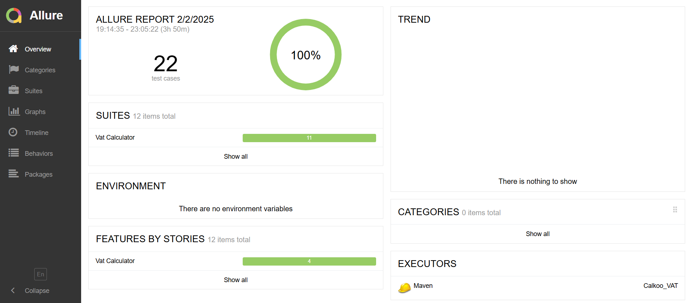

 # Calkoo: The VAT Calculator
This is a repository for the VAT Calculator project. It uses Java, Selenium, Cucumber, JUnit and Maven as a build automation tool.

## Documentation
If you would like to check out the documentation on manual testing, please visit this folder below in project: 
..\Calkoo\Documentation  

## Setup
To run the project, you will need to have the following installed on your computer: 
-Java (Version 21.0.2 2024-01-16 LTS); 
-Selenium (Version 4.28.0); 
-Cucumber (Version 7.12.0); 
-JUnit (Version 5.11.4); 
-Maven (build automation tool); 
-Google Chrome Browser (Version 132.0.6834.160 (Official Build) (64-bit)); 
- https://storage.googleapis.com/chrome-for-testing-public/132.0.6834.159/win64/chromedriver-win64.zip  

## Running the project (Installation)
To run the project, follow the steps below.

***Clone the repository:  *** 
git clone <https://github.com/rcardosopereira/Calkoo>  
***Navigate to the project directory (root of the project) in your terminal or command prompt:  ***
cd Calkoo  
 
***Run the tests using the TestRunner class or via Maven:  ***
"***mvn test***" or "***mvn clean test***"  

***Generate the Allure Report:  ***
After running the tests, generate the report with the following command: 
***mvn allure:serve***  
This will automatically open the report in the browser.  

***Generate the Report for Later Viewing:  ***
If you want to generate the report without opening the browser automatically, use:  
***mvn allure:report***  
The report will be generated in the target/allure-report folder. You can open the index.html file manually in the browser.  

***If necessary, run the command to install dependencies:  ***
"mvn clean install"  

## Explanation of Each Folder and File 
***src/main/java/com/calkoo/utils/ConfigManager.java ***
Contains the ConfigManager class for reading configuration properties from config.properties. 

***src/test/java/com/calkoo/pages/HomePage.java ***
Contains the HomePage class with methods for interacting with the VAT Calculator page. 

***src/test/java/com/calkoo/steps/Steps.java ***
Contains the Steps class with Cucumber step definitions. 

***src/test/java/com/calkoo/runner/TestRunner.java ***
Contains the TestRunner class to execute Cucumber tests. 

***src/test/resources/features/vat_calculator.feature ***
Contains the Gherkin feature file with test scenarios. 

***src/test/resources/driver/chromedriver.exe ***
Contains the ChromeDriver executable for Selenium. 

***src/test/resources/config.properties ***
Contains configuration properties like browser type, URL, and driver paths. 

***src/test/resources/log4j2.xml ***
Contains Log4j2 configuration for logging. 

***pom.xml ***
Maven configuration file for dependencies and plugins (e.g., Cucumber, WebDriverManager, Log4j). 

***README.md ***
Project documentation with instructions for setup and execution. 

## Design decisions
The project was designed to follow the page object model, separating the packages (pages, runner and steps) and pages of the application into individual classes, and using them to interact with the application. The tests themselves use the Cucumber BDD style, allowing for clear, human-readable tests.
